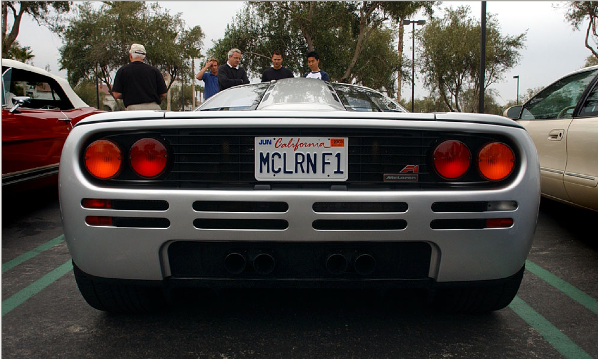
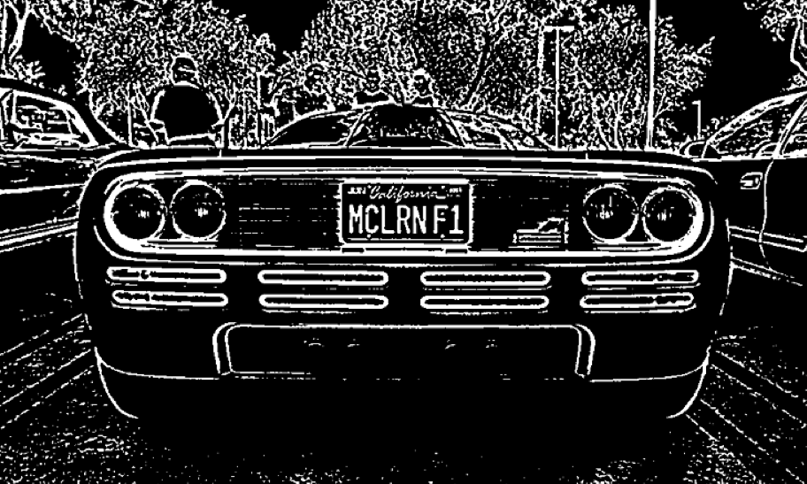
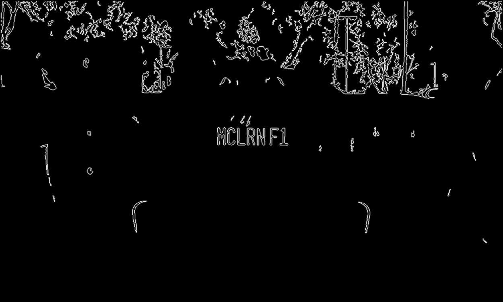
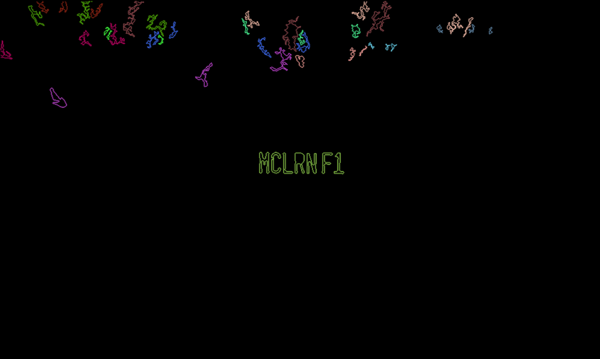
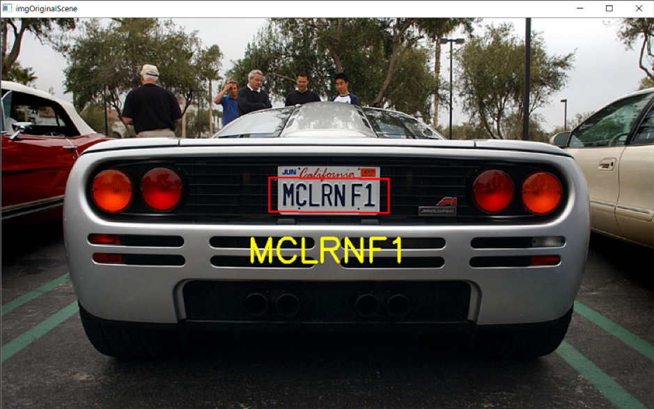

# Licence plate recognition from video feed

### Built Using:
* Python 3.7
* OpenCV 3.0.0
* KNN - k-nearest neighbors

### Detailed Explaination:
* [Read this pdf for detailed explaination](https://github.com/shreyaspapi/licence-plate-recognition-python-opencv/tree/master/DocsAndPresentation)

### Screenshot:

* Working

